# Auction Rollover Example

This section describes an auction epoch rollover example.

Consider the example of a wallet, Wallet A, who creates an auction, Auction A.

### Day 0: Auction Created

| Auction Parameter             | Value              |
| :---------------------------- | :----------------- |
| Network                       | Solana             |
| Base Currency                 | SOL                |
| Quote Currency                | USDC               |
| Min                           | $20 (inclusive)    |
| Max                           | $50 (exclusive)    |
| Notional                      | $200,000           |
| Genesis Epoch Duration        | 10 days            |
| Genesis Epoch Delivery Period | 5 days             |
| Generic Epoch Delivery Period | 2 days             |
| Fee Payer                     | Market Maker       |
| Backup Liquidity Provider     | Jupiter Aggregator |

DFlow hardcodes a set of factors to determine the ending of each epoch's Bid Period. These are not user defined.

| Protocol Parameter | Value |
| :----------------- | :---- |
| Time Factor        | 70%   |
| Notional Factor    | 70%   |

Auction A's Genesis Epoch have the following Bid, Reveal, and Delivery Period:

- Bid Period: 7 days `(Genesis Epoch Duration * Time Factor) = 10 days * 70%`
- Reveal Period: 3 days `(Genesis Epoch Duration - Genesis Epoch Bid Period)`
- Delivery Period: the shorter of 5 days `(Genesis Epoch Delivery Period)` or when $200,000 `(Notional)` is delivered

<!-- gantt
    dateFormat  YYYY-MM-DD-HH
    axisFormat  %Y-%m-%d-%H
    todayMarker off
    title       Day 0
    Current Time: milestone, 2022-10-13-00, 0d

    section Genesis
    Bid Period                  :active,  des1, 2022-10-13-00, 7d
    Reveal Period               :crit,  des2, after des1, 3d
    Delivery Period (maximum)             :crit,  des3, after des2, 5d -->

### Day 0-7: Accepting Bids

### Day 8: Genesis Epoch Bid Period Ends

In the 7 days, three market makers submitted bids into Auction A. During this period, none of them or DFlow can see the bid values.

| Market Maker | Blind Bid Value |
| :----------- | :-------------- |
| A            | $150            |
| B            | $200            |
| C            | $250            |

The Reveal Period starts and all three of them have 3 days to reveal their bids. No new bids can be submitted and market makers are not obligated to reveal. The winning bid will be selected from the pool of _revealed_ bids.

<!-- gantt
    dateFormat  YYYY-MM-DD-HH
    axisFormat  %Y-%m-%d-%H
    todayMarker off
    title       Day 8
    Current Time: milestone, 2022-10-20-00, 0d

    section Genesis
    Bid Period                  :done,  des1, 2022-10-13-00, 7d
    Reveal Period               :active,  des2, after des1, 3d
    Delivery Period             :crit,  des3, after des2, 5d -->

### Day 8-10: Revealing Bids

### Day 11: Genesis Epoch Reveal Period Ends

All market makers have revealed. Market Maker C has the highest bid and thus, wins the right to fill $200,000 of SOL-USDC orders! This also marks the start of Epoch 1's Bid Period.

Wallet A now has a maximum of 5 days to deliver $200,000 worth of SOL-USDC of [$20,$50). Let's say Wallet A delivers $140,000 in 2 days.

<!-- gantt
    dateFormat  YYYY-MM-DD-HH
    axisFormat  %Y-%m-%d-%H
    todayMarker off
    Current Time: milestone, 2022-10-23-00, 0d

    section Genesis
    Bid Period                  :done,  des1, 2022-10-13-00, 7d
    Reveal Period               :done,  des2, after des1, 3d
    Delivery Period (maximum)            :active,  des3, after des2, 5d

    section Epoch 1
    Bid Period                  :active,  des4, after des2, 3d
    Reveal Period               :crit,  des5, after des4, 2d
    Delivery Period (maximum)           :crit,  des6, after des5, 2d -->

### Day 12: Delivering Order Flow

### Day 13: Epoch 1 Bid Period Ends

Epoch 1 has a Bid Period end time that's dependent on which of the following happens first:

- $140,000 `(Total Notional Size * Notional Factor = $200,000 * 70%)`
- 3.5 days `(Genesis Epoch Delivery Days * Time Factor = 5 days * 70%)` since start of Delivery Period

In this case, Wallet ABC delivered $140,000 in 2 days.

<!-- gantt
    dateFormat  YYYY-MM-DD-HH
    axisFormat  %Y-%m-%d-%H
    todayMarker off
    title       Day 13
    Current Time: milestone, 2022-10-25-00, 0d

    section Genesis
    Bid Period                  :done,  des1, 2022-10-13-00, 7d
    Reveal Period               :done,  des2, after des1, 3d
    Delivery Period (Maximum)             :active,  des3, after des2, 5d

    section Epoch 1
    Bid Period                  :active,  des4, after des2, 2d
    Reveal Period               :crit,  des5, after des4, 3d
    Delivery Period (Maximum)            :crit,  des6, after des5, 2d -->

### Day 14: Generic Epoch Delivery and Epoch 1 Reveal Period ends at the same time

Auction A delivers the other $60,000 the next day and Genesis Epoch has officially ended. Epoch 1 Reveal Period also ended and the next $200,000 worth of SOL-USDC starts being delivered to the winner of Epoch 1.

Note Epoch 1 has a different maximum Delivery Period because auction operator defines Generic Epoch Delivery Period.

<!-- gantt
    dateFormat  YYYY-MM-DD-HH
    axisFormat  %Y-%m-%d-%H
    todayMarker off
    title       Day 14
    Current Time: milestone, 2022-10-26-00, 0d

    section Genesis
    Bid Period                  :done,  des1, 2022-10-13-00, 7d
    Reveal Period               :done,  des2, after des1, 3d
    Delivery Period (Actual)             :done,  des3, after des2, 3d

    section Epoch 1
    Bid Period                  :done,  des4, after des2, 2d
    Reveal Period               :done,  des5, after des4, 1d
    Delivery Period (Maximum)            :active,  des6, after des5, 2d

    section Epoch 2
    Bid Period                  :active,  des7, after des5, 1d
    Reveal Period               :crit,  des8, after des7, 1d
    Delivery Period (Maximum)            :crit,  des9, after des8, 2d -->

<!-- ## Rollover Takeaway

1.  This auction structure ensures a continuous delivery of order flow:

    - End of `Epoch N-1`'s Delivery Period == start of `Epoch N`'s Delivery Period

2.  Having `Time Factor` and `Notional Factor` ensures market makers have sufficient time to reveal bids, ensuring the winner of next epoch is known in advance:

3.  Epoch rolls over to next depending on previous epoch

    - `Epoch N`'s Delivery Period is based on both `Notional` and a user defined parameter (i.e `Genesis Epoch Delivery Period` or `Generic Epoch Delivery Period`) -->
